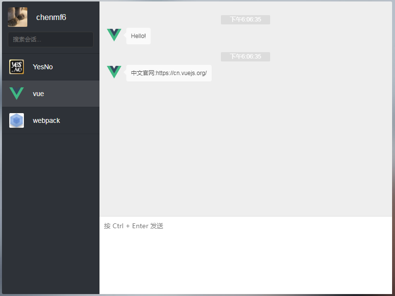

# vue2-chat

> 模仿微信聊天

> [在线演示请戳这里](https://chenmf6.github.io/vue2-chat/)



## 基本功能
- 输入关键字筛选会话
- 发送本地消息
- 利用sessionStorage存储消息
- 利用api实现简单的在线问答对话

## 参考项目
> [chat example by vue.js + vuex + webpack](https://github.com/Coffcer/vue-chat)

> [vuex-example-chat](https://github.com/vuejs/vuex/tree/dev/examples/chat) 
  

## Build Setup

``` bash
# install dependencies
npm install

# serve with hot reload at localhost:8080
npm run dev

# build for production with minification
npm run build

# build for production and view the bundle analyzer report
npm run build --report
```
